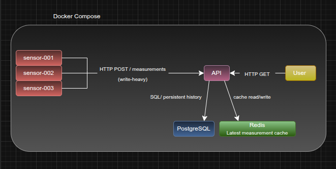
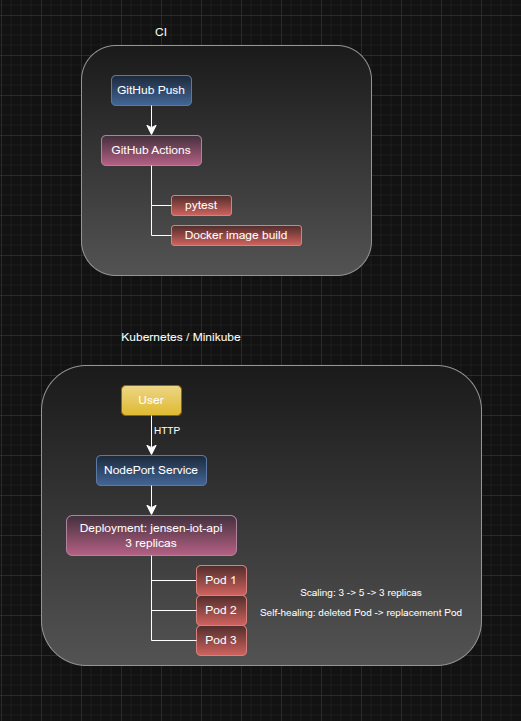

# Arkitektur

Jensen IoT Platform består av ett Flask-baserat REST API, tre simulerade
IoT-sensorer, PostgreSQL och Redis. Den lokala miljön körs med Docker Compose.

Sensorerna skickar kontinuerligt mätdata till API:t via `POST /measurements`, vilket utgör systemets huvudsakliga write-heavy-flöde. Giltiga mätningar lagras persistent i PostgreSQL.

Redis används som cache för den senaste mätningen från varje sensor. Vid läsning av det senaste mätvärdet används cache-aside: API:t försöker först läsa från Redis och hämtar värdet från PostgreSQL vid cache miss.

## Lokal Docker Compose-miljö

Den lokala miljön består av API, simulator, PostgreSQL och Redis. PostgreSQL används för beständig historik medan Redis används för cache av den senaste mätningen.

## CI och Kubernetes

Projektet använder GitHub Actions för CI. Vid push körs automatiserade tester med `pytest` och API:ts Docker-image byggs.

Kubernetes-delen körs lokalt med Minikube. API:t körs i en Deployment med tre Pod-repliker och exponeras genom en NodePort Service. Deploymenten har använts för att demonstrera både scaling och self-healing.

